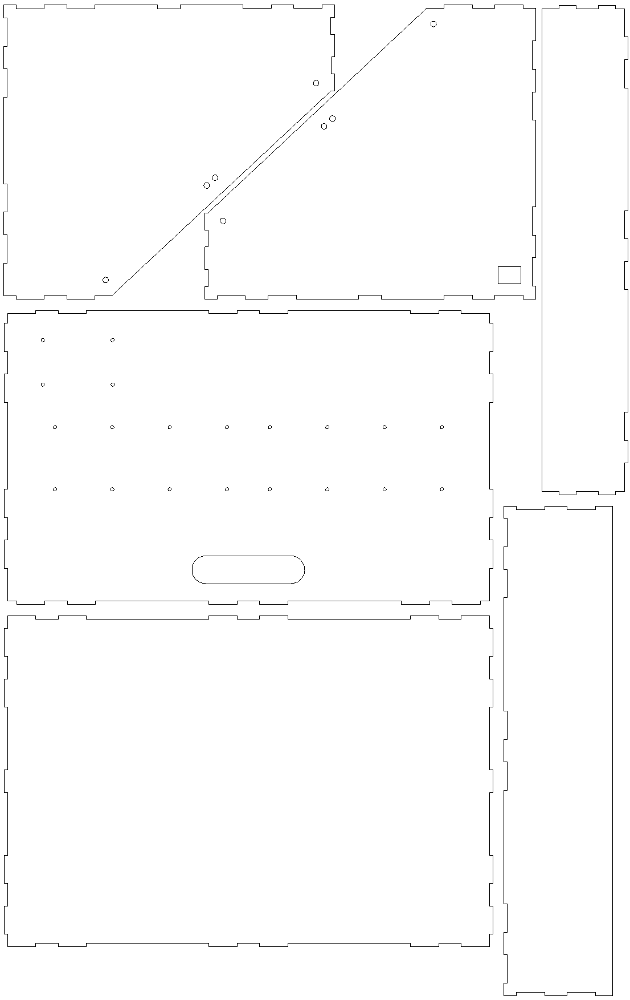

# Eurorack Case

This is an 84HP 6U eurorack case which can be laser cut from 3mm thick materials such as plywood. It's a version of [this studio case by Nonlinearcircuits](https://www.thingiverse.com/thing:1206118), modified to be cut from thinner material. This is entirely motivated by the materials available for laser cutting at my local library, and if you have access to thicker materials you should probably use the original design.

The version in this repository also adds mounting holes for the power supply and busboards from the [Doepfer A-100 DIY Kit #1](http://www.doepfer.de/a100_DIY_kits.htm), as well as a cutout for the DC power socket.

**Please note:** I have not yet cut and constructed this design, and the mounting holes may be incorrect. I will include photos in this repository once I have successfully built it.

